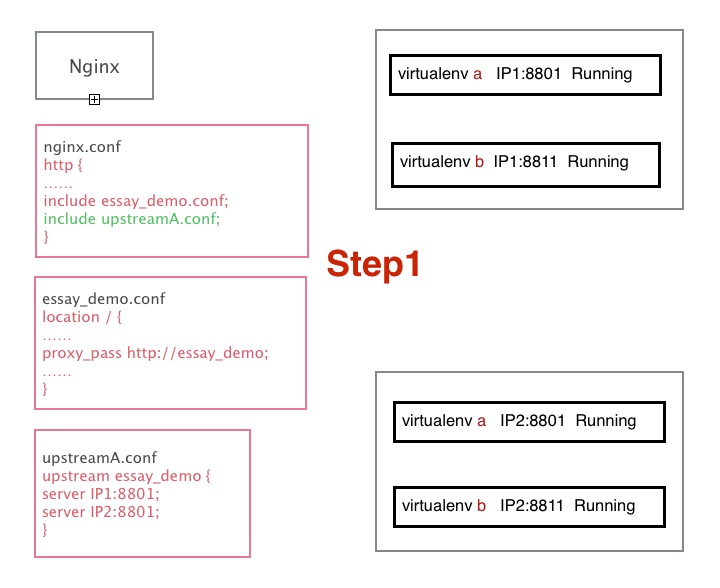
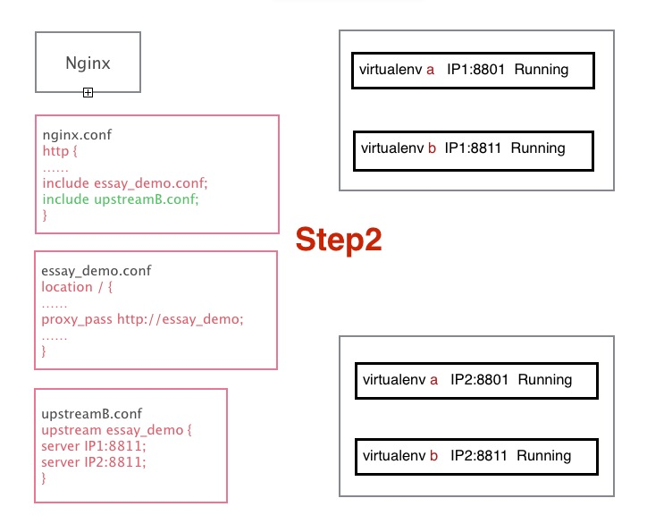

# 介绍： 

------------------------------------

essay是我们团队在过去两年Python项目持续部署上经验的总结，核心功能是打包和多Server部署。我们使用这个工具的主要目的是简化从开发到部署的流程，方便服务器的扩展。除了打包和部署功能之外，essay还提供了其他的工具，在后面的接口描述中有详细介绍。

essay是基于Fabric开发，在使用上依赖于pypi Server和github/Gitlab。

# 快速开始

------------------------------------

*这里使用自己搭建的pypiserver作为pypi server，github作为代码仓库。*

1. 安装essay： ``pip install essay``
2. github上创建项目：essay_demo_webpy
3. **创建项目**。终端上执行： ``es create essay_demo_webpy`` ，根据提示输入你新创建的git仓库地址，回车完毕你会发现你的github上已经有了初始化好的一个项目结构

        .
        └── essay_demo_webpy
            ├── MANIFEST.in
            ├── README.md
            ├── conf
            │   └── supervisord.conf
            ├── essay_demo
            │   ├── __init__.py
            │   ├── log.py
            │   ├── main.py
            │   └── settings.py
            ├── fabfile
            │   └── __init__.py
            └── setup.py

        4 directories, 9 files

4. **打包项目**。此时你可以在本地的essay_demo_webpy目录下执行： ``fab -l`` 命令查看哪些命令可用。然后执行 ``fab build.build`` 命令，会帮你打包成tar的源码包，并添加版本后缀，如：essay_demo_webpy-3.11.20.1.tar.gz，之后会被上传到上面说到得pypiserver上。

    关于build.build有四个可选参数,fab build.build:name=fixbug,version=0.1,commit=451a9a2784f,branch=master,也可以使用位置参数: ``fab build.build:fixbug,0.1,451a9a2784f,master`` 。其中commit和branch不能同时设置,commit优先于branch起作用。

    各参数详解：

        name, 版本的后缀，如上例的结果是: essay_demo_webpy-0.1-fixbug.tar.gz
        varsion, 版本号，如果为空则会产生：essay_demo_webpy-3.11.20.1-fixbug.tar.gz。规则是：年.月.日.次
        commit, 是要打包的commit节点
        branch, 要打包的分支，默认为fabfile下__init__.py中的配置

5. **部署项目**。这时在pypiserver上已经有了打好的包，假设为: essay_demo_webpy-3.11.20.1.tar.gz 。然后开始安装，执行： ``fab -R dev deploy:3.11.20.1,a,test`` 把项目安装到fabfile里设置的dev这个role的服务器上，可以是一个或者多个server。
    
    *deploy参数解释：*
        
        deploy后面有三个参数，分别表示：版本号，虚拟环境目录名，profile（会传递到supervisord.conf中）
        版本号在上面已经提到，不赘述。
        虚拟环境目录名：依赖于fabfile中设置的 env.VIRTUALENV_PREFIX='~/essay_demo_webpy' ，这里参数为a，表示将在服务器家目录下得essay_demo_webpy目录下创建一个目录为 a 的virtualenv环境。
        profile：用来控制程序处于什么状态，比如可以传递debug进去，需要程序自己处理。参数会被传递到supervisord.conf中。

deploy的内部的过程是：登录-R指定的服务器，在配置的VIRTUALENV_PREFIX目录下创建a虚拟环境，之后在此环境中通过pip安装已打包好的项目，最后通过supervisord来启动程序进程。

*可以参考Demo：https://github.com/SohuTech/essay_demo_webpy 中的一些配置*

# 配置文件详解

------------------------------------

介绍主要的两个配置文件fabfile和supervisord

### fabfile配置

** myproject/fabfile/__init__.py **

所有env配置项，可根据自身业务删除/添加

		1. git服务器

			env.GIT_SERVER = 'https://github.com/' # ssh地址只需要填：github.com

		2. 项目名（与git上项目名保持一致） 
		
			env.PROJECT = 'project_name'
		
		3. 项目在打包服务器上的路径，会在此目录下执行打包操作
		
			env.BUILD_PATH = '/opt/deploy/'
		
		4. 项目所有者（与git保持一致）
		
			env.PROJECT_OWNER = 'EssayTech'
		
		5. git默认分支
		
			env.DEFAULT_BRANCH = 'master'
		
		6. pypi-server地址
		
			env.PYPI_INDEX = 'http://pypi.python.org/simple/'
			
		部署相关：
		
		7. 部署启动进程数目
		
			env.PROCESS_COUNT = 2 #部署时启动的进程数目, 会传递到supervisord.conf中
		
		8. 服务器角色, 打包或部署时通过 ``-R`` 参数指定服务器角色, 每个角色可以定义多组服务器
			
			env.roledefs = {
			'build': ['username@buildserverip:port'], # 打包服务器配置
			'dev': ['eassay@127.0.0.1:2202'],	#部署服务器配置
			}

		9. 虚拟环境目录, 部署时会在服务器上此目录下创建虚拟环境
			
			env.VIRTUALENV_PREFIX = '/home/SohuTech/project_name'
		
		12. supervisor配置文件地址, PROJECT_ROOT为项目根目录
		
			env.SUPERVISOR_CONF_TEMPLATE = os.path.join(PROJECT_ROOT, 'conf', 'supervisord.conf')
			
		13. 根据工程确定项目编号, 不同虚拟环境监听不同的端口，用来配置一个同一机器多个虚拟环境。通过port参数传到supervisord.conf中。
				
			PROJECT_NUM = 88
			env.VENV_PORT_PREFIX_MAP = {
			'a': '%d0' % PROJECT_NUM,
			'b': '%d1' % PROJECT_NUM,
			'c': '%d2' % PROJECT_NUM,
			'd': '%d3' % PROJECT_NUM,
			'e': '%d4' % PROJECT_NUM,
			'f': '%d5' % PROJECT_NUM,
			'g': '%d6' % PROJECT_NUM,
			'h': '%d7' % PROJECT_NUM,
			'i': '%d8' % PROJECT_NUM,
			}

        nginx配置用于启动、停止、重启、修改配置文件:

		14. nginx执行文件地址
			
			env.NGINX_BIN = '/usr/local/nginx/bin/nginx'
			
		15. nginx配置文件地址
		
			env.NGINX_CONF = '/usr/local/nginx/conf/nginx.conf'
			
		16. 切换nginx环境(关于此项，请看下方essay高级功能用法)

			env.NGINX_SWITCH_CONF = '/etc/nginx/nginx.conf'

### supervisord配置

** myproject/conf/supervisor.conf **

**几个被替换的字段**

		以下参数在fab deploy的时候会替换为fabfile里配置的字段
		
		1. {{ run_root }}  虚拟环境地址,对应于fabfile/__init__.py里的env.VIRTUALENV_PREFIX
		
		2. {{ username }}	essay.task.util自动生成用户名
		
		3. {{ password }}	essay.task.util自动生成密码
		
		4. {{ project }}	项目名,对应于fabfile/__init__.py里的env.PROJECT
		
		5. {{ port }}  取env.VENV_PORT_PREFIX_MAP对应虚拟环境的端口号
		
		6. {{ process_count }}  对应于fabfile配置中的PROCESS_COUNT
		
		
**具体配置**
		
		#项目名（被自动替换）
		[program:{{ project }}]		
		
		#运行命令
		command={{ venv_dir}}/bin/{{ project }} --profile={{ profile }} 	
		
		#进程名，示例：test_2
		process_name=%(program_name)s_%(process_num)d	
		
		#设置进程umask，即权限为755
		umask=022	
		
		#启动后10秒内没有异常则认为启动成功
		startsecs=10		
		
		#等待0秒退出
		stopwaitsecs=0	
		
		#重定向日志输出地址
		redirect_stderr=true	
		
		
		#日志输出地址
		stdout_logfile={{ run_root }}/logs/process_%(process_num)02d.log
		
			
		#启动进程数
		numprocs={{ process_count }}	
		
		#如果开启进程数大于1，则指定从序号为0的进程开始
		numprocs_start=0	

# 可用命令清单及详解

------------------------------------

**1. 创建本地工程,然后同步到git服务器(需要git仓库地址)**

		用默认模板创建
		
		1. 先在gitlab/github上创建库：myprojecti，拿到git地址
		
		2. es create myproject (后边不加-t参数会使用默认模板创建项目)
		
		3. 输入项目git地址
		
		用django模板创建
		
		es create myproject -t django

**2. 创建本地工程,创建时不需要连接git服务器,后期需要自己git init**

	#####用法一：
		
		生成全新项目
		
		1. es init myproject
		
		2. cd myproject
		
		3. git init
		
		4. git remote add origin [git库地址]
		
		5. 然后就可以commit和push了	

	#####用法二：

		在已存在项目下
		
		1. cd myproject
		
		2. es init
		
		会为项目生成fabfile, conf, setup.py, MANIFEST.in, README.md

**3. 打包**

		1. fab build.build

**4. 获取项目最新版本号**

		1. cd myproject

		2. fab build.get_latest_version

**5. 计算项目下一版本号**

		1. cd myproject

		2. fab build.get_next_version

**6. 部署(参数: 项目版本号, 虚拟环境名, profile)**
	
		1. cd myproject
	
		2. fab deploy:3.11.18.2,virtualenv_name,test 

**7. 重启指定虚拟环境的supervisor(参数: 虚拟环境名)**

		1.cd myproject

		2.fab supervisor.reload:virtualenv_name

**8. 重启虚拟环境的项目的特定进程(参数: 进程名, 虚拟环境名)**

		1. cd myproject
		
		2. fab supervisor.restart_process:process_name,virtualenv_name

**9. 启动虚拟环境的项目的特定进程(参数: 进程名, 虚拟环境名)**

		1. cd myproject

		2. fab supervisor.start_process:process_name,virtualenv_name

**10. 关闭虚拟环境的项目的特定进程(参数: 进程名, 虚拟环境名)**

		1. cd myproject

		2. fab supervisor.stop_process:process_name,virtualenv_name

**11. 启动nginx(参数: nginx执行命令地址, nginx配置文件地址)**

		
		注意: nginx_bin, nginx_conf 可在myproject/fabfile/__init__.py中配置
		例如: env.NGINX_BIN = '/usr/local/nginx/sbin/nginx'
			  env.NGINX_CONF = '/usr/local/nginx/conf/nginx.conf'

		1. cd myproject

		2. fab nginx.start
		
		如果不配置__init__.py
		
		fab nginx.start:nginx_bin,nginx_conf

**12. 重启nginx(参数: nginx执行命令地址, nginx配置文件地址)**

		1. cd myproject

		2. fab nginx.reload:nginx_bin,nginx_conf

**13. 关闭nginx(参数: nginx执行命令地址, nginx配置文件地址)**

		1. cd myproject

		2. fab nginx.stop:nginx_bin,nginx_conf
 

**14. 修改nginx配置文件并重启(参数: 源文本, 目标文本, nginx执行命令令, nginx配置文件地址)**

		1. cd myproject

		2. fab nginx.switch:src_pattern,dst_pattern,nginx_bin,nginx_conf

**15. 获取帮助**

		es -h
		
**16. 从内部pypi安装包,pypi服务器地址在project/__init__.py中可设置**

		es pinstall xxx
		
**17. 从官方pypi安装包(支持pip其他命令)**

		es install xxx
		

# 高级功能介绍

------------------------------------

介绍nginx服务器配置以及a，b环境切换的处理

**功能：**

    1. 保证新代码上线时，重启某一虚拟环境中的web服务，不会对用户访问造成中断。
    2. 新上线代码出现bug时，及时回滚到上一次的版本。
    
**场景介绍**
    
    假设目前有server1和server2两台服务器，ip分别为ip1、ip2。两台服务器均部署了两个虚拟环境a和b。a环境运行的项目监听在端口8801，b环境运行的项目监听在端口8811。

下面是简单的nginx示例：

*nginx.conf*

		user nginx;
		worker_processes 1;
		 
		#error_log /var/log/nginx/error.log warn;
		pid /var/run/nginx.pid;
		 
		events {
            worker_connections 1024;
		}
		 
		http {
            include /etc/nginx/mime.types;
            default_type application/octet-stream;
            
            log_format main '$remote_addr - $remote_user [$time_local] "$request" '
            '$status $body_bytes_sent "$http_referer" '
            '"$http_user_agent" "$http_x_forwarded_for"';
            
            #access_log /var/log/nginx/access.log main;
            
            sendfile on;
            #tcp_nopush on;
            
            keepalive_timeout 65;
            
            #gzip on;
            
            
            include extra/essay_demo.conf;
            include extra/upstreamA.conf;
		}
		
*extra/essay_demo.conf*
		
		server {
			listen 80;
			server_name localhost;
			access_log /var/log/nginx/essay.access.log main;
			location / {
				proxy_pass http://essay_demo;
				proxy_intercept_errors on;
				proxy_redirect off;
				proxy_connect_timeout 60;
				proxy_set_header Host $host;
				proxy_set_header X-Real-IP $remote_addr;
				set $cookiesize '0';
				if ($http_cookie ~ "_"){
					set $cookiesize 1;
				}
			}
		}

*extra/upstreamA.conf*

		upstream essay_demo {
			server ip1:8801;
			server ip2:8801;
		}

*extra/upstreamB.conf*

		upstream essay_demo {
			server ip1:8811;
			server ip2:8811;
		}
		
目前nginx中配置的是upstreamA.conf，此时用户的访问会被反向代理到ip1和ip2的8801端口上。现在发布新版本上线，使用命令： ``fab -R dev deploy:<版本号>,b,test`` ,发布到b环境。

之后通过命令： ``fab -R nginx nginx.switch:upstreamA,upstreamB`` 把nginx中的upstreamA替换为upstreamB，并reload nginx，这样用户的访问就会被反向代理到ip1和ip2的8811端口上，也就是刚才发布到b环境中的新部署的项目。

**switch完整命令**
fab -R nginx nginx.switch:src_pattern,dst_pattern,root,nginx_bin,nginx_conf

*switch参数解释：*
	
		src_pattern: 原文本 (必填)
		
		dst_pattern: 目标文本 (必填)
		
		root: 是否使用root用户,  是：root 否：None (可选项，默认为None)
		
		nginx_bin: nginx执行命令路径，可以在fabfile/__init__.py下设定 (可选项)
		
		nginx_conf: nginx配置文件路径，可以在fabfile/__init__.py下设定 (可选项)
		

**图示**

### fab -R dev nginx.switch: upstreamA.conf, upstreamB.conf

